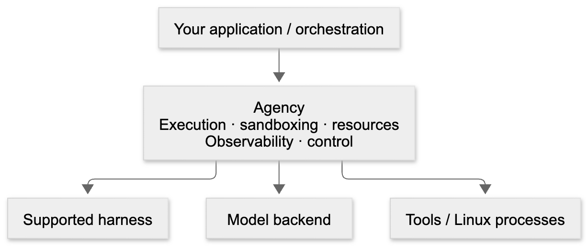

# Agency

**See. Understand. Control.**

See what your agents are doing. Understand why. Control what happens next.

**Any model. Any harness.**

Agency gives you one place to observe and control agent execution, while
keeping your existing agent stack and orchestration.

> **Product GIF placeholder** — live execution and trajectory, systems/model
> profiling, and runtime intervention.

<!-- TODO: Replace this block with docs/assets/agency-demo.gif showing live agent
execution, trajectory + systems/model profiling, and runtime intervention.
Planned recording using existing views and Python controls. -->

## See

Follow a live trajectory that groups model/tool calls and highlights waits,
repeated failures and requests for input. Tell what is progressing and what
needs attention before opening individual calls. Recorded profiles add
process activity, CPU/memory/I/O samples, optional GPU metrics, and reported
file or artifact effects.

## Understand

Distinguish model wait, CPU work and scheduler/dependency waits. Inspect the
context supplied to the model, tool arguments/results, failures and retries.
Compare runs for trajectory divergence, timing changes and multi-agent
dependencies or overlapping work. Recorded evidence stays separate from
inferred actions; missing data remains unavailable. [Profiler views](docs/guides/profiling/views.md)
explain how to read it.

## Control

**Observe → understand → intervene → measure**

Use Python controls to pause, resume or cancel. Redirect supported interactive
harnesses mid-run; native or unavailable delivery queues context for later
submissions. Set CPU/memory limits, request GPU leases, apply tool/syscall
policies and attach custom tools through supported integrations. Choose
sandbox images and project mounts for your environment.

Controls are best-effort. Image checkpoints capture filesystem state;
optional ZFS restore is private to the same sandbox. Host mounts and external
side effects are outside rollback. See [control behavior](docs/architecture/orchestrator.md)
and [checkpoint limits](docs/api/sandboxes.md#checkpoint-backends).

## Underneath your agent stack

Agency supplies the runtime underneath your application. Choose a supported
harness and model independently; keep workflow logic in your Python loops,
state machines, supervisor/worker systems or queues. LangGraph, Temporal or
Ray integrations use application-written calls; dedicated adapters are not
included. Agency schedules local invocations and returns pending results.



[Editable diagram source](docs/assets/agency-runtime.mmd).

| Component | Implemented choices |
| --- | --- |
| Harness | Native, Claude Code, Codex, OpenCode, Grok, Kimi |
| Model backend | OpenAI Chat Completions / Responses, Anthropic, Bedrock, tool-capable OpenAI-compatible endpoints such as vLLM |

Pairings require matching model features and CLI versions; external CLIs need
installation. See [configuration and requirements](docs/guides/configuration.md).

## Quick start

Use **Linux x86-64**, **Python 3.12+**, Git,
[uv](https://docs.astral.sh/uv/getting-started/installation/) and local
**Docker or Podman** on the driver's host. Check `docker info` or `podman info`;
the Python client does not install an engine.

Install from source:

```bash
git clone https://github.com/agency-project/agency.git
cd agency
uv sync --locked --python 3.12

export OPENAI_API_KEY="your-api-key"
export OPENAI_MODEL="gpt-6-luna"
uv run python examples/quickstart.py
```

The example uses native with OpenAI Chat Completions and function tools;
the model must accept `reasoning_effort="none"`. `OPENAI_MODEL` defaults as
shown. Requests incur API charges. The script reads the exported key without
loading `.env`.

First startup needs network access to pull the image and install dependencies.
GPU passthrough is disabled; no GPU, ZFS, CRIU or host provisioning is needed.
[Getting started](docs/getting-started.md) covers setup failures.

## Basic usage

A skill defines the task and input/output fields. This is the complete workload
in [quickstart.py](examples/quickstart.py). Save it as `first_agent.py` and run
`uv run python first_agent.py` from the checkout:

```python
import os
from pathlib import Path

from agency import Agent, agdata, agskill
from agency.configs.agconfig import agconfig, llmconfig, resourcesconfig, sandboxconfig

cfg = agconfig(
    llmconfig(
        provider="openai",
        base_url="https://api.openai.com/v1",
        model=os.environ.get("OPENAI_MODEL", "gpt-6-luna"),
        api_key=os.environ["OPENAI_API_KEY"],
        reasoning_effort="none",
        max_completion_tokens=4096,
    ),
    sandboxconfig(gpu_passthrough=False),
    resourcesconfig(idle_cpus=1),
)
task = agskill(
    name="code_and_test",
    prompt="Complete the request in /workspace. Run the code, then summarize the result.",
    input_schema=agdata(request=str),
    output_schema=agdata(summary=str),
)
worker = Agent("coder", agconfig=cfg, harness="native")
result = worker.run(
    task,
    agdata(request="Write sum_even(numbers) in Python and run assertions for empty and mixed lists."),
)
result.wait()
print(result.summary)
print(f"Run directory: {Path(worker.data_logger.db_path).parent.parent}")
```

`run()` returns a pending result; wait before reading output. Check
`result.to_dict()` for `error` after failure. Code runs inside `/workspace`;
the printed host directory retains logs after sandbox cleanup on process exit.

## Profile the run

Run the same example with the dashboard and profiler:

```bash
AGENCY_PROFILE=1 AGENCY_PROFILE_SCOPE=workload \
  uv run python examples/quickstart.py --webui
```

Open [the dashboard](http://localhost:7860/) or
[profiler](http://localhost:7860/profiler) for live trajectory and model/tool
activity. After completion, **Raw trace → Reload trace** loads the finalized
systems trace. First Perfetto startup needs internet; the server binds to
`0.0.0.0`. [Profiling guide](docs/guides/profiling.md) covers saved runs and setup.

## Compare runs

Vary a supported harness, model or CPU allocation. Compare trajectories,
resource contention, scheduling waits and task outcomes, or redirect an
interactive harness and compare its continuation. The common runtime and
telemetry support reproducible experimentation; retain source, configuration,
environment and outcome evidence with each run.

## Next steps

- [Examples](examples/README.md): tools, context, workflows and files.
- [API reference](docs/api/index.md): signatures, defaults and current contracts.
- [Architecture](docs/architecture/index.md): package responsibilities, design and execution flow.
- [Contributing](CONTRIBUTING.md): development setup and checks.
