# External Harness Execution Loop

> **Status:** describes the implemented, empirically-verified execution path
> for a harness-driven skill call (`engine != "native"`), as of the
> `claude_code.py` in-container + UDS-relay + session-continuity work. This
> document is the "what actually happens, in order" companion to
> [Design_harness_integration.md](Design_harness_integration.md) (the "why
> it's shaped this way") and [Design_harness_history.md](Design_harness_history.md)
> (the continuity mechanism in depth). It does not re-derive rationale
> already covered there — see those documents for the reasoning behind any
> given step; this one is the sequence itself.

## Core framing

A harness-driven skill call has exactly one opaque region: the harness
binary's own process, from the moment it `execve`s until it exits. Agency
constructs everything before that point and consumes everything after it,
but has zero visibility into the harness's own internal reasoning, its real
system prompt, its internal turn boundaries, or which of its own built-in
tools it chose to use for a given step — **except** at two seams that cross
the boundary regardless of what the harness does internally: every LLM call
it makes (it has to leave the process to reach a model) and every syscall
its own tool execution performs (the kernel sees it even if nothing in the
harness's own code reports it). Everything in this document is organized
around that boundary.

## Participants

| Actor | What it is | Where it runs |
|---|---|---|
| Caller | `agent.run(skill, skill_input)` → `agskill.run()` | Agency's own process |
| `_ClaudeCodeBackend.execute()` | `harness/agharness_backends/claude_code.py` | Agency's own process |
| `agProxyPtrace` / launch path | `agproxy_ptrace.py`, dispatching to either `TracerLoop` (host fork) or `InContainerRelay` (`_in_container_launcher.py`) | Agency's own process |
| In-container entrypoint | `_in_container_entrypoint.py` — only exists for a docker/podman-backed sandbox | Inside the sandbox container, via `docker/podman exec` |
| **Harness binary** (`claude`) | The unmodified, real CLI | Inside the sandbox container (docker/podman) or the bare host (chroot/none) |
| `agproxy_llm` gateway | `agproxy_llm.py` — one process-wide FastAPI server | Agency's own process (host) |
| TCP-to-UDS relay | `_tcp_to_uds_relay.py` — only exists for a docker/podman-backed sandbox | Inside the sandbox container |
| Real LLM backend | Whatever `ag.llm.backend` is configured to (Bedrock, Anthropic, vLLM, ...) | Wherever that backend actually lives |
| `agpolicy` | The real allow/deny/rewrite decision-maker | Agency's own process (host) — **always**, even for a container-backed launch |

## Sequence diagram

```mermaid
sequenceDiagram
    participant Caller as Caller<br/>(agent.run)
    participant Backend as _ClaudeCodeBackend<br/>.execute()
    participant Launch as agProxyPtrace /<br/>launch path
    participant Entry as In-container entrypoint<br/>(container-backed only)
    participant Harness as Harness binary<br/>(BLACK BOX)
    participant Relay as TCP-to-UDS relay<br/>(container-backed only)
    participant Gateway as agproxy_llm<br/>gateway
    participant Policy as agpolicy<br/>(host, always)
    participant LLM as Real LLM backend

    Caller->>Backend: execute(ag, prev_ctx, skill_input, skill)
    Backend->>Backend: resolve binary (host PATH or in-container `which`)
    Backend->>Gateway: register(token, ag)
    Backend->>Backend: materialize config_home (host tempdir or in-container dir)
    Backend->>Backend: build prompt (input JSON + output-format text)
    alt prior session exists (ag._harness_sessions)
        Backend->>Backend: write session blob into config_home at derived path
        Backend->>Backend: add --resume <session_id> to argv
    end
    opt container-backed sandbox
        Backend->>Gateway: ensure_uds_started()
        Backend->>Relay: deploy + launch (docker exec -i), forward local port → UDS
        Relay-->>Backend: READY, port
    end
    Backend->>Backend: build envp (ANTHROPIC_BASE_URL, AUTH_TOKEN, CLAUDE_CONFIG_DIR, ...)
    Backend->>Launch: launch(argv, envp, cwd=config_home, policy, ag, sandbox?)

    alt container-backed sandbox
        Launch->>Entry: docker/podman exec -i <container> python3 entrypoint.py
        Entry->>Entry: fork() INSIDE container's own PID namespace
        Entry->>Entry: PTRACE_TRACEME + install raw-BPF seccomp filter
        Entry->>Harness: execve(claude, argv, envp)
    else host/chroot
        Launch->>Launch: fork() on the host
        Launch->>Launch: PTRACE_TRACEME + install seccomp filter (pyseccomp)
        Launch->>Harness: execve(claude, argv, envp)
    end

    rect rgb(40, 40, 40)
    note over Harness: BLACK BOX — harness's own internal loop.<br/>Its own system prompt, tool list, turn count,<br/>and reasoning are never observed directly.
    loop until the harness decides it's done
        Harness->>Gateway: LLM request (ANTHROPIC_BASE_URL)
        opt container-backed sandbox
            Harness->>Relay: (request actually goes here first)
            Relay->>Gateway: forwarded over bind-mounted UDS socket
        end
        Gateway->>Gateway: resolve token → agent, translate wire format
        Gateway->>LLM: chat.completions.create(...)
        LLM-->>Gateway: response
        Gateway-->>Harness: translated back to harness's wire format
        Harness->>Harness: decides to run one of its OWN built-in tools
        Harness->>Entry: real syscall (execve/openat/...) — trapped by seccomp
        Entry->>Policy: resolved agsyscallevent (argv/envp/path)
        Policy-->>Entry: agdecision (allow/deny/rewrite)
        Entry->>Entry: apply decision, PTRACE_CONT
    end
    Harness->>Harness: prints ONE final JSON result, exits
    end

    Launch-->>Backend: handle.wait() → (stdout, stderr, rc)
    opt rc == 0
        Backend->>Backend: parse result/usage/session_id
        Backend->>Backend: read session blob back, store on ag._harness_sessions
    end
    Backend->>Gateway: unregister(token)
    opt container-backed sandbox
        Backend->>Relay: terminate
    end
    Backend->>Backend: cleanup_config_home[_in_container]
    Backend->>Backend: validate_and_recover(final_text, output_schema)
    Backend->>Backend: prev_ctx.messages = [user_msg, assistant_msg]  (replace, not append)
    Backend-->>Caller: (result_agdata, prev_ctx, [sys_msg, user_msg, assistant_msg])
```

## Step-by-step walkthrough

**Setup (Agency-controlled, before the black box)**

1. **Dispatch.** `agskill.run()` checks `ag.harness`: `"native"` goes to
   `execute_react` (untouched); anything else goes to
   `agharness_backend.for_config(ag.agconfig).execute(...)` — for
   `harness="claude_code"`, that's `_ClaudeCodeBackend.execute()`.
2. **Resolve the binary.** Host/chroot: `shutil.which(binary)` on the host
   PATH. Container-backed: `ag.sandbox.exec("which claude")` — resolved
   *inside* the container, since that's where it will actually run.
3. **Register with the gateway.** `gateway.register(token, ag)` — a fresh
   `uuid4().hex` bearer token mapped to this agent for the duration of this
   one launch. `agproxy_llm.py`'s route handlers use this token, not
   whatever model name the harness itself requests, to pick the real
   backend.
4. **Materialize `config_home`.** Host/chroot: `tempfile.mkdtemp()`.
   Container-backed: a directory created *inside* the container via
   `sandbox.exec("mkdir -p ...")` (`agharness.materialize_config_home_in_container`)
   — a host tempdir would be invisible to a process in the container's own
   mount namespace.
5. **Build the prompt.** `agharness.build_user_turn_prompt` +
   `build_output_format_instruction` turn `skill_input` into the harness's
   *one* input surface: a plain user-turn string. No system prompt, no tool
   injection — the harness's own operation stays untouched.
6. **Check for a prior session.** If `ag._harness_sessions["claude_code"]`
   has a stored blob, it's written into this launch's `config_home` at the
   path the harness itself will look for it at (`_session_path`), and
   `--resume <session_id>` is added to `argv`. See
   [Design_harness_history.md](Design_harness_history.md) for why this file
   is opaque to Agency and what "the path it'll look for it at" means.
7. **Start the host services and sandbox daemon.** `AgentEngine` starts the
   host-side HTTP services on a UDS, then `ensure_harness_daemon()` launches
   one Harness Manager daemon through the sandbox backend and passes it the
   bridged host-services socket path.
8. **Submit the attempt.** The engine sends a `HarnessAttemptRequest` to the
   daemon. The daemon builds the adapter environment, including the local
   proxy URL and isolated config home.
9. **Launch.** The adapter calls the single `harness/ptrace/` supervisor in
   the daemon process. Because the daemon is already inside the sandbox, its
   fork lands in the correct PID and mount namespaces without another
   launcher or relay. The traced child performs `PTRACE_TRACEME`, installs a seccomp filter
   (`SECCOMP_RET_TRACE` on `execve`/`execveat` by default — the filter's
   default action is `ALLOW`, so only the listed syscalls ever generate a
   stop), then `execve(claude, argv, envp)`. **This `execve` is the last
   thing Agency controls before the black box starts.**
10. Each intercepted syscall is sent to the host interaction service over
    the host-services UDS. Its allow/deny response is applied before the
    traced process resumes.

**Inside the black box — observed only at two seams**

11. The harness's own process runs its own agentic loop: its own system
    prompt, its own tool-dispatch code, its own decision about how many
    internal turns to take. None of this is visible directly.
12. **Seam 1 — the LLM endpoint.** Every request the harness makes to
    `ANTHROPIC_BASE_URL` physically leaves the harness's control flow.
    Container-backed: it first hits the local relay, which forwards it
    over the bind-mounted UDS socket to the real gateway process on the
    host. Either way, `agproxy_llm.py`'s route handler resolves the bearer
    token back to `ag`, reshapes the request into `chat.completions.create()`
    (translate mode) or forwards it as-is (passthrough mode), calls the
    *agent's own configured* backend — not whatever the harness itself
    would have called — and reshapes the response back to the harness's
    wire format.
13. **Seam 2 — the syscall boundary.** When the harness's own tool
    execution does an `execve`/`execveat` (the default filtered set), the
    kernel traps it via seccomp before it runs. The stop is resolved into
    an `agsyscallevent` (argv/envp/path where decodable) and handed to
    `agpolicy.check(ag, event)` — for a container-backed launch, this means
    the in-container entrypoint sends the event out over its own stdio and
    blocks for a decision, which the host-side `InContainerRelay` computes
    by calling the *real* policy object and writes back; for a host/chroot
    launch, the callback runs in-process directly. The returned
    `agdecision` (allow/deny/rewrite) is applied — deny fails the syscall
    with `EPERM`, rewrite injects a new argv (execve-family only) — and the
    tracee resumes.
14. `default_policy(ag)` (`_LoggingAllowAllPolicy`) also calls
    `ag.log._tool_call(...)` for each event, best-effort — the current
    logging fidelity is syscall-argv-level, not the richer per-tool-name
    detail native gets (a known, documented gap, see
    `Design_harness_integration.md`'s Component 5).
15. Steps 12–14 repeat for as many internal turns as the harness decides it
    needs — Agency has no say in when this loop ends.
16. The harness prints its single final `--output-format json` object and
    exits. **The black box ends here.**

**Completion (Agency-controlled again)**

17. `handle.wait(timeout)` blocks until the root process *and everything it
    spawned* has exited, and returns `(stdout, stderr, rc)`.
18. If `rc == 0`: parse the JSON result for `result`/`usage`/`session_id`,
    then — **before `config_home` is torn down** — read the (possibly
    updated) session file back out and store it on `ag._harness_sessions`,
    base64'd, for the next call.
19. `finally`: unregister the gateway token, terminate the relay process
    (container-backed only), and clean up `config_home` (host `rmtree` or
    in-container `rm -rf`) — zero trace left either way.
20. Non-zero `rc` becomes an `agerror` carrying stdout/stderr; otherwise the
    final text is validated/recovered against `skill.output_schema` (or
    wrapped raw), `prev_ctx.messages` is **replaced** (not appended) with
    `[user_msg, assistant_msg]` — no system message, see the note below —
    and `(result, prev_ctx, [sys_msg, user_msg, assistant_msg])` returns to
    the caller.

## What ends up in `agcontext`, precisely

`agcontext.messages` is *overwritten* each call, not accumulated — a second
harness call erases the first's `[user_msg, assistant_msg]` pair, not stack
on top of it (contrast `total_input_tokens`/`total_output_tokens`, which do
accumulate via `+=` a few lines above). Neither message is a system message;
`sys_msg` (`skill._build_system_prompt()`) only appears in the *returned*
`delta_messages` list, for logging/webui display, and even that is a
fabrication for display consistency — it was never actually sent to the
harness, whose own real, built-in system prompt is invisible to Agency
entirely, same as its internal reasoning. The one thing that actually
carries turn-to-turn memory for consecutive same-engine calls is the opaque
session blob (step 6/18), not `agcontext` — see
[Design_harness_history.md](Design_harness_history.md) for why that's the
deliberate design, not an oversight.

## Host/chroot vs. container-backed, side by side

| | Host / chroot | Docker / podman |
|---|---|---|
| Harness process lives | Bare host | Inside the container |
| `config_home` | Host tempdir | In-container directory |
| Fork happens | Directly on the host | Inside a `docker/podman exec`'d entrypoint |
| `agpolicy.check()` runs | In-process | Still on the host — relayed over the entrypoint's stdio |
| LLM traffic reaches the gateway via | Direct TCP (`ANTHROPIC_BASE_URL` = gateway's own host:port) | Container-local relay → bind-mounted Unix socket → gateway |
| Filesystem the harness's tools see | The real host filesystem at `config_home`/cwd | The container's own real filesystem — no interception layer needed |
| Container/sandbox lifetime for this call | N/A (no sandbox teardown mid-call) | Coarsens to one full harness invocation — native's per-tool-call hibernation can't apply once the harness's own live process is what's inside the container |

## What this document doesn't cover

- *Why* the harness runs inside the container at all (and why the FUSE
  alternative was tried and abandoned) — `Design_harness_integration.md`'s
  Prerequisites, and the superseded `Design_harness_filesystem.md`.
- The full session-continuity design, its rejected alternative (splicing
  `agcontext` into the LLM request — empirically shown to break), and its
  open items — `Design_harness_history.md`.
- Backends other than Claude Code: Codex/opencode/Grok follow the same
  shape in principle (per-harness `argv`/`envp` construction, same
  `agProxyPtrace`/`agproxy_llm` seams) but none of the container/UDS-relay/
  session-continuity work in this document has been extended to them.
