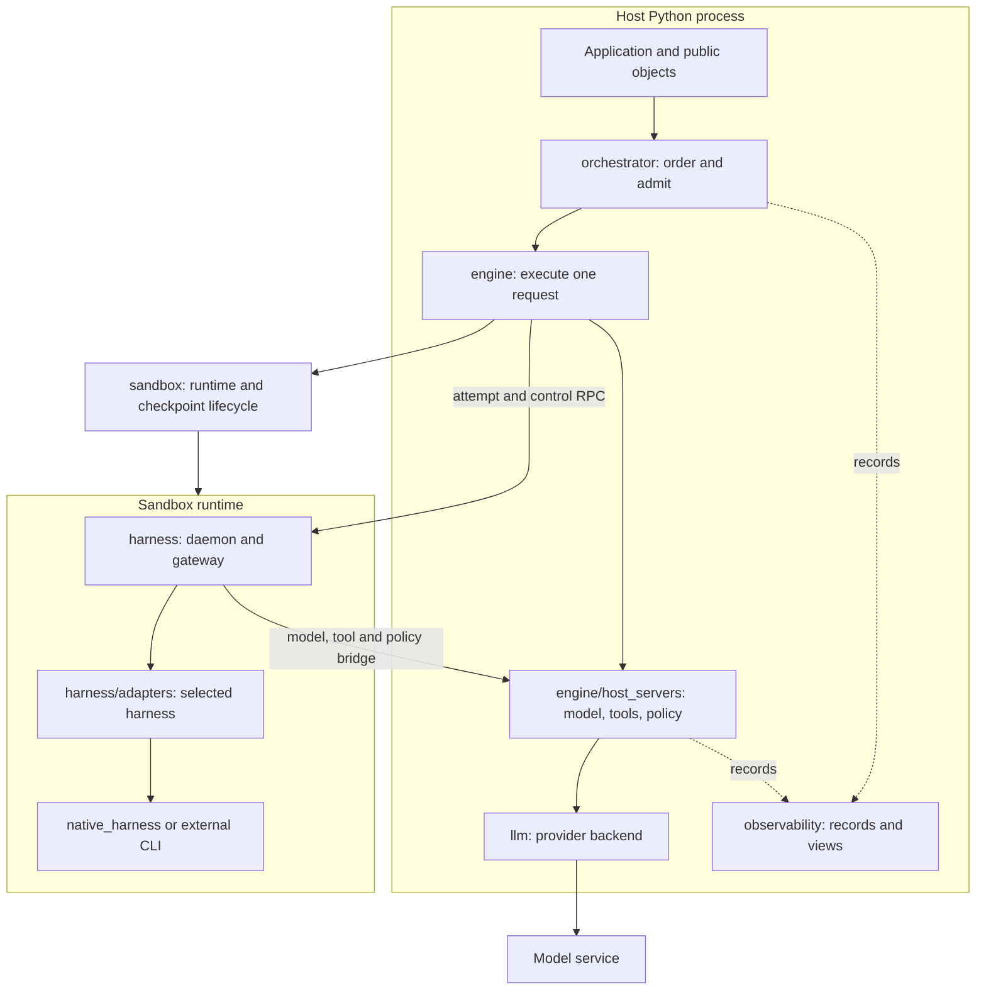

# Agency architecture

Agency composes a coding agent from a harness, a model backend, a sandbox and a skill contract. The application describes the work in Python; Agency orders requests, runs the selected harness, routes its model and tool calls, and publishes the result with updated conversation and filesystem state.

The source package lives in `agency/` at the repository root. These pages follow its directories and explain the responsibilities and connections implemented in the code.

## Package map

| Source directory | Design responsibility |
| --- | --- |
| [`agency/configs/`](configs.md) | Configuration shared across components, with explicit namespaces and safe snapshots. |
| [`agency/orchestrator/`](orchestrator.md) | Dependency ordering, execution admission, result settlement and shared resource allocation. |
| [`agency/engine/`](engine.md) | One request's execution lifecycle and the host services used by its harness. |
| [`agency/harness/`](harness.md) | Sandbox daemon, CLI adapters, protocol translation and process supervision. |
| [`agency/native_harness/`](native_harness.md) | Agency's own model-and-tool loop, packaged as a standalone CLI. |
| [`agency/llm/`](llm.md) | Provider selection and translation between Agency messages and provider protocols. |
| [`agency/sandbox/`](sandbox.md) | Runtime backends, filesystem access, resource limits and checkpoints. |
| [`agency/observability/`](observability.md) | Event storage, profiling, trajectory reconstruction and the Web UI. |
| [`agency/host/`](host.md) | Explicit machine provisioning and validated runtime profiles. |
| [`agency/utils/`](utils.md) | Python workflow helpers and shared runtime utilities. |

Nested directories are described on their parent package's page. The modules directly under `agency/` define the public objects that connect these packages.

## The public object model

An `agent` owns configuration, conversation context, logging and a sandbox reference. Its selected harness determines which coding-agent implementation runs. An `agskill` describes one piece of work: instructions, input/output schemas, tools and policy. Keeping the skill separate from the agent lets the same contract run through different harnesses.

`agdata` carries inputs and outputs, including pending results backed by Python futures. `agcontext` carries the latest transcript, per-harness session snapshots and retained messages. `agschema` and the `agtype` classes define field types and prepare or recover file-backed values across the sandbox boundary. `agtool` wraps a Python callable; `agpolicy` supplies tool and syscall hooks. `agteam` groups agents and a Python workflow.

These objects are implemented in [agent.py](../../agency/agent.py), [agskill.py](../../agency/agskill.py), [agdata.py](../../agency/agdata.py), [agcontext.py](../../agency/agcontext.py), [agschema.py](../../agency/agschema.py), [agtype.py](../../agency/agtype.py), [agtool.py](../../agency/agtool.py), [agpolicy.py](../../agency/agpolicy.py) and [agteam.py](../../agency/agteam.py). [The package exports](../../agency/__init__.py) bring them together for applications.

## Where execution happens

The host owns scheduling, provider credentials and host Python tool closures. The sandbox owns the daemon and harness processes. Control and callback traffic use separate local socket connections; the sandbox gateway presents the HTTP and MCP interfaces the harness expects. This layout comes from [engine execution](../../agency/engine/engine.py), [host service assembly](../../agency/engine/host_servers/host_server_manager.py) and [the harness daemon](../../agency/harness/daemon.py).

## One request through the system

1. `agent.run()` submits a skill and returns a pending `agdata`. Submission registers the request and publishes a new context future together. Later work on that agent depends on this context; pending input values can introduce dependencies on other agents.
2. The orchestrator waits for dependencies and admits ready work within its engine limit. It assigns one engine to the request.
3. The engine locks the sandbox, prepares inputs, starts host services and sends an attempt to the sandbox daemon. The selected adapter launches or reuses its harness. Model calls return through the host's LLM backend; tool and policy calls use the host or sandbox tool service.
4. The engine validates output and can request another attempt for missing structured fields. It retires host services before returning from harness execution. On success it claims completion against cancellation, invokes the sandbox commit and publishes staged harness session state. Failure discards working runtime and staged session changes.
5. The worker reports completion to the orchestrator. The orchestrator settles context and releases request capacity before resolving the public result.

The design keeps request ordering, execution and harness behavior in separate owners. It coordinates conversation and sandbox state within a live process. External mount writes, host-tool effects and model-service effects remain outside filesystem rollback. Adapter completion also does not establish task correctness; see [harness completion](harness.md#completion-and-session-continuity) and [known contracts](../api/contracts.md).

For callable signatures, use the [API reference](../api/index.md). For installation and configuration, use [getting started](../getting-started.md) and the [guides](../guides/configuration.md).
