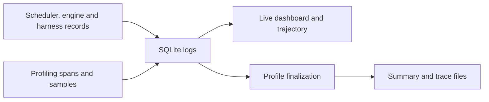

# observability — records, profiling and views

`agency/observability/` records execution and turns those records into timelines, resource summaries and interactive views. Its data describes what happened; authoritative request state stays in the [orchestrator](orchestrator.md), and filesystem state stays in [sandbox](sandbox.md).

## Internal responsibilities

| Source area | Responsibility |
| --- | --- |
| [agdatalogger.py](../../agency/observability/agdatalogger.py) | SQLite persistence for events, spans, snapshots, model exchanges and stream deltas. |
| [profiler/](../../agency/observability/profiler/agprof.py) | Profiling sessions, spans, automatic Python intervals, CPU/wait accounting and resource sampling. |
| [profiler/agprof_trace.py](../../agency/observability/profiler/agprof_trace.py) | Trace export and summary generation. |
| [agwebui/](../../agency/observability/agwebui/__init__.py) | Web UI lifecycle, workload wrapping and live control relay. |
| [agwebui/server.py](../../agency/observability/agwebui/server.py) and [trajectory.py](../../agency/observability/agwebui/trajectory.py) | Read saved records and assemble dashboard/trajectory views. |

## Collection to presentation

Each agent has a SQLite logger for frequent execution records; the process-wide logger records scheduler and shared-resource events. Model exchanges preserve messages and streamed deltas, while runtime events and spans carry request, agent and sandbox identities.

Writes are batched. The UI parent periodically flushes loggers, and the server subprocess reads committed records. Live dashboards and trajectory views use this database path. Completed raw traces have a separate profiling-session finalization boundary.

## Session ownership

`agprof` maintains one active profiling session. Explicit session boundaries or workload/process wrappers own start and stop. Stopping sampling and closing open intervals allows summary and trace generation. Background work must be joined inside a workload boundary if its execution should be included. Host spans, sandbox reports and process/cgroup counters provide different views of the same run.

The Web UI relays controls to live Python agents in the parent process; reading a saved database alone does not restore those agents. Logs are observation storage rather than a request recovery journal, and a crash can lose unflushed rows.

## Measurement limits

Wall time includes provider latency, startup and idle waits. Nested spans overlap, so adding parent and child durations double-counts time. Counters are sampled, and missing usage or resource data should remain unavailable. Reconstructed activity labels and harness completion do not establish task correctness.

Use the [profiling guide](../guides/profiling.md) for viewing runs and [runtime reference](../api/runtime.md) for session APIs. Historical benchmark observations are retained in the [measurement archive](../archive/measurements.md), separately from the package design.
